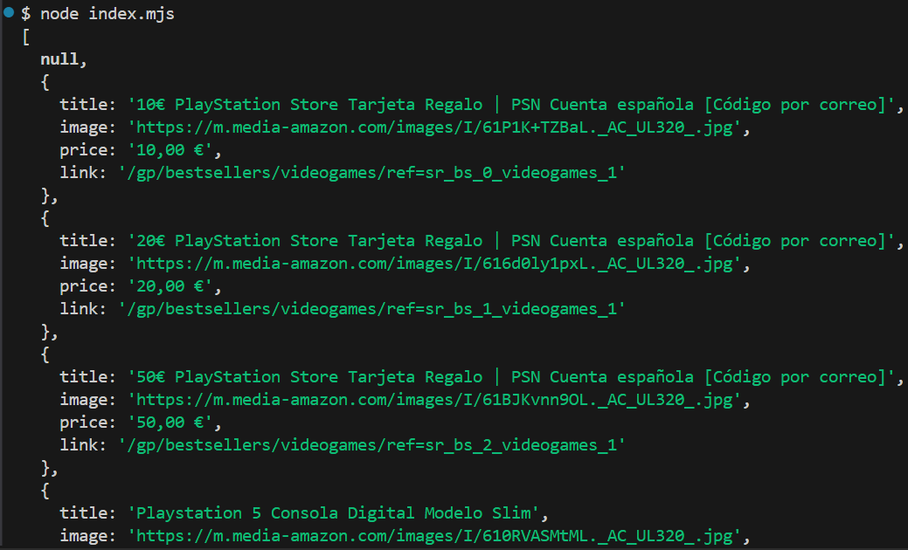

# Cómo hacer Web Scrapping en cualquier página web con JavaScript

## Extrae los datos de una página web y transformarlo en un archivo json

1. Se necesita tener node instalado en nuestro equipo.

2. Inicializamos el proyecto con el siguiente comando `npm init -y`

3. Luego instalamos la dependencia de __playwright__ `npm install playwright`

4. Crea el archivo `index.mjs` con editor favorito.

5. Finalmente importamos `chromium` de la dependencia de `playwright` dentro del archivo `index.mjs`

```jsx
index.mjs

import { chromium } from "playwright";
//... Aquí va resto de código.
```

6. Salida de datos en `json`

